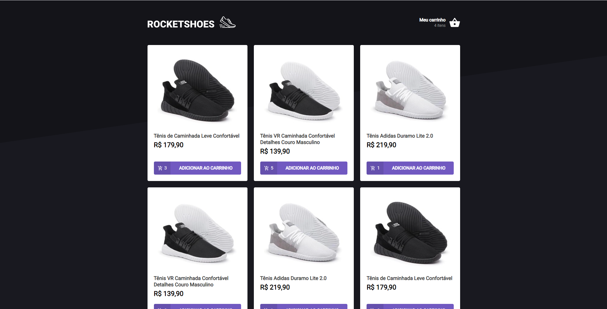

	<a href="#sobre"> Sobre </a>&nbsp;&nbsp;&nbsp;|&nbsp;&nbsp;&nbsp;
  <a href="#techs"> Tecnologias </a>&nbsp;&nbsp;&nbsp;|&nbsp;&nbsp;&nbsp;
  <a href="#run"> Como usar </a>&nbsp;&nbsp;&nbsp;

  

  

## Sobre 🚀 <a name="sobre" />

A **RocketShoes** é o terceiro desáfio do **Ignite** da [Rocketseat](https://rocketseat.com.br/). Esse desafio tinha como objetivo principal implementar um hook no carrinho de compras, para controlar a entrada e saída de produtos.

## Techs ​⚙ ​<a name="techs" />

- React
- Typescript
- Json Server
- Context API
- Styled Components
- Polished
- React Toastify

## Instalação e execução ​ℹ️ ​<a name="run" />

1. Faça um clone desse repositório;
2. Entre na pasta rodando `cd ignite-react-desafio-03`;
3. Rode `yarn` para instalar as dependências;
4. Rode `yarn server` para rodar a api fake;
5. Rode `yarn start`;
